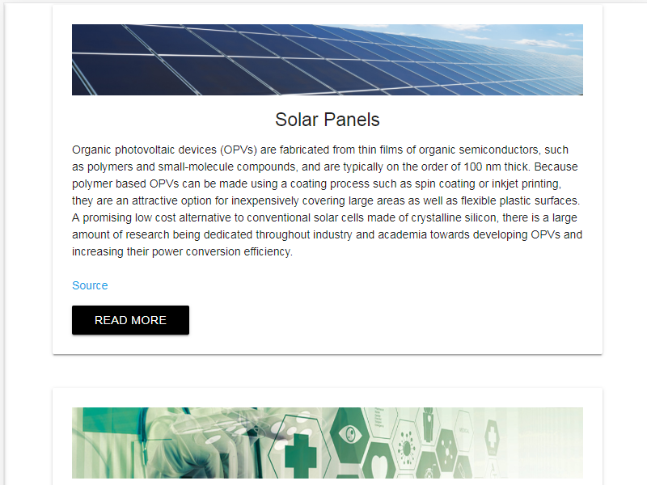
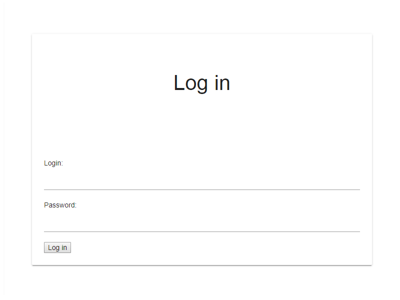
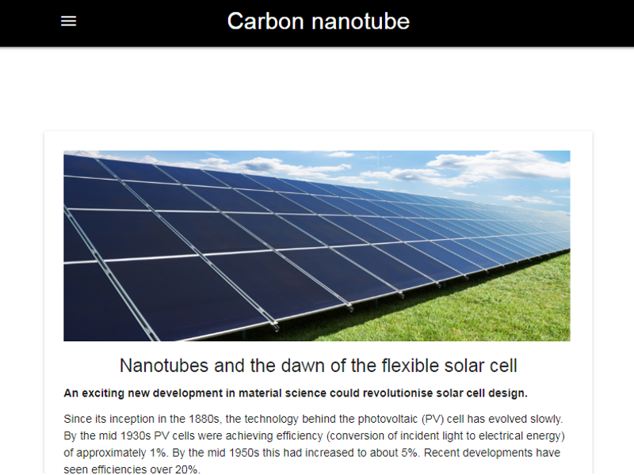

# Nanoelectronics
Easy and simple web page about nanotubes. Created using:
* [Materialize] - based on Starter Template.

### Index
 

### Login page
 

### Articles pages
 

### Installation

Download all file and open **index.html** to run.
To open any article u should to login. Use this login and password:

```sh
Login: admin
Password: admin
```

If u want to change this u should to open all pages and change this variables to your.

```sh
var spr1="admin";
var spr2="admin"
```

The original photos can be found in the **photo** catalog.

[Materialize]: <https://materializecss.com/getting-started.html>

